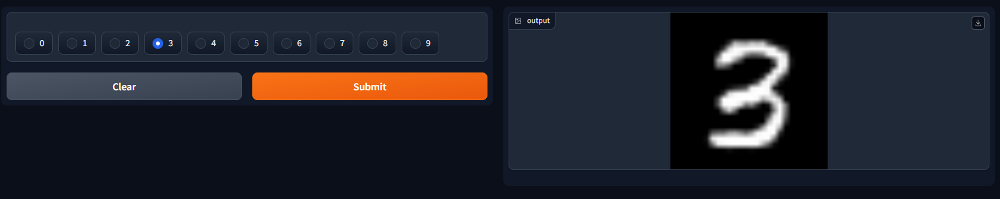

# Conditional GAN Trained on MNIST Dataset

[Paper](https://arxiv.org/pdf/1411.1784.pdf)

For this project, I developed conditional GAN from scratch, with the specific goal of generating realistic images of handwritten digits. In order to ensure optimal training performance, a MNIST dataset of 60k samples was used (10k for each class). Model was trained for a total of 2000 epochs, which took approximately 3 hours on an NVIDIA A100 40GB GPU.

## 2500 generated handwritten digits


## Training


## Load pretrained model in HDF5 format

```python
generator = load_model('cgan.h5')
```

## Load pretrained model's weights

In order to load weights, model has to be compiled

```python
# Initialize optimizers
opt_g = Adam(learning_rate=0.0001, beta_1=0.5)
opt_d = Adam(learning_rate=0.00001, beta_1=0.5)

# Initialize losses
loss_g = BinaryCrossentropy()
loss_d = BinaryCrossentropy()

# Initialize models
generator = build_generator()
discriminator = build_discriminator()
gan = GAN(generator, discriminator)
gan.compile(opt_g, opt_d, loss_g, loss_d)

gan.load_weights('./checkpoints/my_checkpoint')
```

## Demo

You can use the the demo on [Hugging Face](https://huggingface.co/spaces/matusstas/cGAN)


