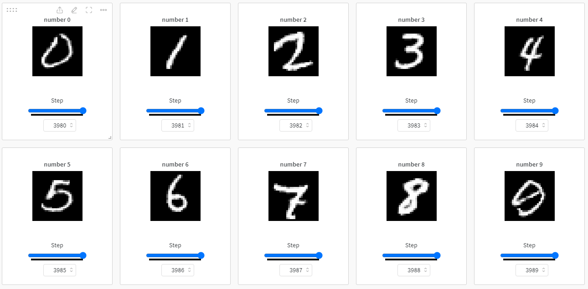

# Conditional GAN

**IF YOU FIND THIS REPOSITORY HELPFUL, PLEASE CONSIDER STARRING IT.**


Tensorflow implementation of Conditional GAN with the specific goal of generating realistic images of handwritten digits. To ensure optimal training performance, the MNIST dataset, which consists of 60,000 samples (10,000 for each class), was used. Model was trained for a total of 2000 epochs, which took approximately 3 hours on an NVIDIA A100 40GB GPU. Demo is available on [Hugging Face](https://huggingface.co/spaces/matusstas/cGAN). Training is available on [Weights & Biases](https://wandb.ai/matusstas/GAN?workspace=user-matusstas).


## Load pretrained model in HDF5 format

```python
generator = load_model("cgan.h5")
```

## Load model's weights

```python
# Initialize optimizers
opt_g = Adam(learning_rate=0.0001, beta_1=0.5)
opt_d = Adam(learning_rate=0.00001, beta_1=0.5)

# Initialize losses
loss_g = BinaryCrossentropy()
loss_d = BinaryCrossentropy()

# Initialize models
generator = build_generator()
discriminator = build_discriminator()
gan = GAN(generator, discriminator)
gan.compile(opt_g, opt_d, loss_g, loss_d)

gan.load_weights("./checkpoints/my_checkpoint")
```

## Weights & Biases


