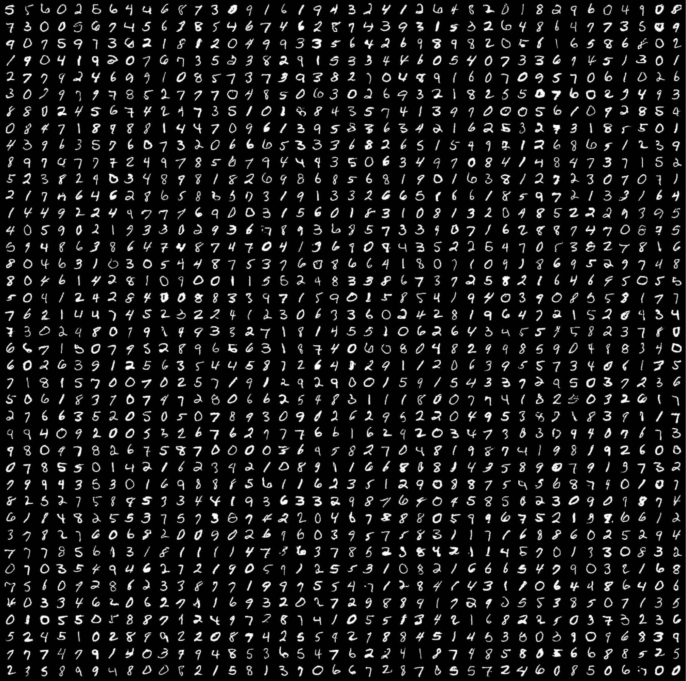

# Conditional GAN

Tensorflow implementation of Conditional GAN with the specific goal of generating realistic images of handwritten digits. MNIST dataset of 60k samples was used (10k for each class) to ensure optimal training performance. Model was trained for a total of 2000 epochs, which took approximately 3 hours on an NVIDIA A100 40GB GPU. Demo is available on [Hugging Face](https://huggingface.co/spaces/matusstas/cGAN). 



## Load pretrained model in HDF5 format

```python
generator = load_model("cgan.h5")
```

## Load weights

```python
# Initialize optimizers
opt_g = Adam(learning_rate=0.0001, beta_1=0.5)
opt_d = Adam(learning_rate=0.00001, beta_1=0.5)

# Initialize losses
loss_g = BinaryCrossentropy()
loss_d = BinaryCrossentropy()

# Initialize models
generator = build_generator()
discriminator = build_discriminator()
gan = GAN(generator, discriminator)
gan.compile(opt_g, opt_d, loss_g, loss_d)

gan.load_weights("./checkpoints/my_checkpoint")
```
