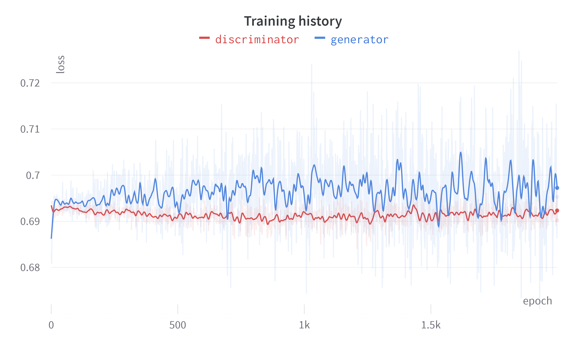

# Conditional GAN trained on MNIST dataset

[Paper](https://arxiv.org/pdf/1411.1784.pdf)

For this project, I developed conditional GAN from scratch, with the specific goal of generating realistic images of handwritten digits. In order to ensure optimal training performance, a MNIST dataset of 60k samples was used (10k for each class). Model was trained for a total of 2000 epochs, which took approximately 3 hours on an NVIDIA A100 GPU.

## 2500 generated handwritten digits


## Training


## Load trained model

```python
g_opt = Adam(learning_rate=0.0001, beta_1=0.5)
d_opt = Adam(learning_rate=0.00001, beta_1=0.5)

g_loss = BinaryCrossentropy()
d_loss = BinaryCrossentropy()

generator = build_generator()
discriminator = build_discriminator()

gan = GAN(generator, discriminator)
gan.compile(g_opt, d_opt, g_loss, d_loss)

gan.load_weights('./checkpoints/my_checkpoint')
```
